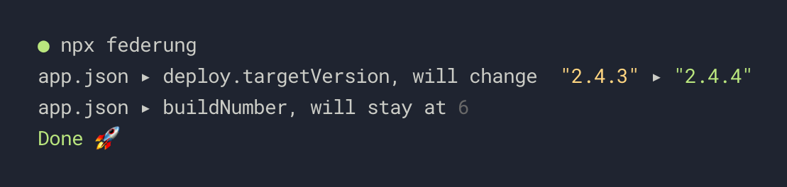

# Federung

Federung is an interactive CLI tool that helps you to change all your versions in one place.
Federung is also the german word for suspension – because it helps with your bumps!

We use it for some build scripts where we may have to change some version numbers in some cases, but not every time. It can also help to just remind you to check if you incremented all the right numbers.

(We use it in compination with Expo to remind us to first update our build versions before starting new iOS and Android builds. But you can use it for whatever you want!)


## Installation and Usage

First, install as a dev dependency:

```sh
npm install --save-dev federung
```

Federung uses [Cosmiconfig](https://github.com/davidtheclark/cosmiconfig). Add the `federung` key to your `package.json` and list the files and paths you want to get asked about when you run the tool:

```js
{
  // ...
  "scripts": {
    // ...
    "deploy": "federung && deploy-update"
  },
  "federung": {
    "versions": [
        {
        "file": "app.json",
        "keyPath": "deploy.targetVersion"
      }, {
        "file": "app.json",
        "keyPath": "buildNumber"
      }
    ]
  }
}
```

In this example, the final output would look like this:



Federung lets you enter a new version for every keyPath. If you don't want to set a version, press enter to skip it. Federung will also do its best to keep the types of your version numbers the same.

In the example, we also added `federung` to the `npm run deploy` command. That way, whenever you run your deploy script, Federung will first ask you if you want to update any options.


## Configuration

The configuration object takes one property, `versions`,  which takes an array of places that Federung will look for version numbers:

```js
{
  "versions": [
    {
      //  The file you want to open. Currently, only JSON files are supported.
      "file": "app.json" // string.
      
      // Path to your property. If the property is deep in your JSON, use a "." to drill down. 
      "keyPath": "keyPath.to.your.property" // string.
    }]
}
```

Hint: We use [`lodash.get`](https://lodash.com/docs/4.17.4#get) to interpret the `keyPath`, so anything that works with `lodash.get` will work.

----

<p align="center">Made with 💚 in Berlin & Cologne</p>
